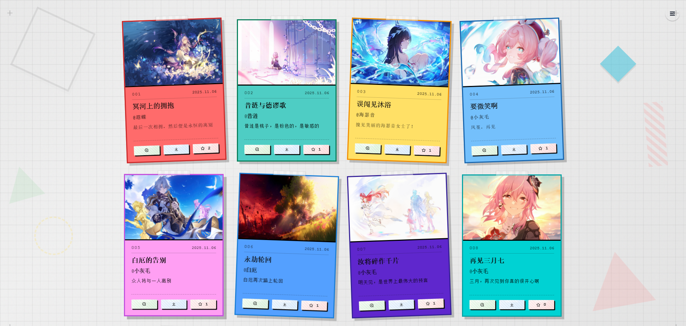
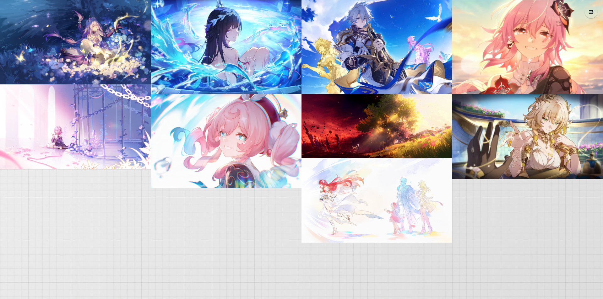
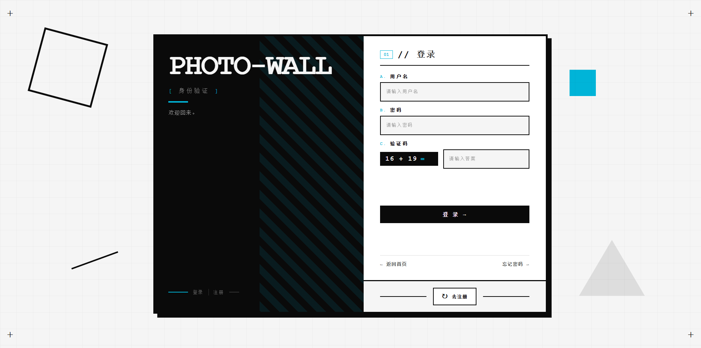

# 🌟 Hanphone's Blog

[](server/)
[](web/)
[](https://github.com/HanphoneJan/hanphone-blog/actions)
[](LICENSE)

个人博客系统，采用前后端分离架构：Next.js + Spring Boot。

博客内还集成了多个纯前端子项目（工具集合、有趣网页、小游戏、照片墙），部署在同一域名下。
[工具](https://hanphone.cn/tools) · [有趣网页](https://hanphone.cn/play) · [小游戏](https://hanphone.cn/games) · [照片墙](https://hanphone.cn/atlas/)

采用 **pnpm workspace** 管理多包（Monorepo）：web 前端 + apps（gomoku / photo-wall）+ admin-file 文件服务 + photo-wall-server 后端。

[在线演示](https://hanphone.cn) · [快速开始](#快速开始) · [文档索引](#文档) · [测试指南](#测试)

---

## 截图预览

### 入场动画


### 博客首页

| 亮色主题                        | 暗色主题                       |
| ------------------------------- | ------------------------------ |
|  |  |

| 马卡龙主题                          | 赛博朋克主题                        |
| ----------------------------------- | ----------------------------------- |
|  |  |

### 照片墙

| 便利贴布局 | 瀑布流布局 |
|------------|------------|
|  |  |

| 登录页面 |
|----------|
|  |

---

## 技术栈

- **前端主站**: Next.js 15 + React 18 + TypeScript + Tailwind CSS + Tauri
- **照片墙**: Vue 3 + Vite + Element Plus + Pinia
- **后端**: Spring Boot 3.2.12 + Java 17 + JPA + MyBatis Plus 3.5.9 + PostgreSQL + Redis（统一认证）
- **文件服务**: Express.js 5 + Multer + JWT（独立文件存储服务）
- **照片墙后端**: Express.js 5 + PostgreSQL（照片墙专属业务）
- **小游戏**: Uni-app + Vue 3 + uni-h5

---

## 快速开始

### 环境要求

- Node.js >= 18 (推荐使用 pnpm), Java JDK >= 17, Maven >= 3.6
- PostgreSQL >= 12, Redis >= 5.0

### 初始化工作区

本项目已升级为 **pnpm workspace** 架构，可统一管理前端各个项目。

```bash
# 在根目录安装所有依赖
pnpm install
```

### 启动后端

```bash
cd server/
cp env.example .env
# 编辑 .env 配置数据库
mvn spring-boot:run
```

后端运行在 http://localhost:8090

### 启动文件服务

```bash
# 根目录下执行
pnpm --filter admin-file start
```

文件服务运行在 http://localhost:4000，Swagger 文档地址 http://localhost:4000/api-docs

### 启动前端

```bash
# 根目录下执行
pnpm --filter web dev
```

前端运行在 http://localhost:3000

### 启动照片墙前端

```bash
# 根目录下执行
pnpm --filter atlas dev
```

照片墙前端运行在 http://localhost:3000/atlas/

---

## 测试

本项目包含完整的测试套件，支持单元测试和 E2E 测试。

### 运行测试

```bash
# 后端单元测试
cd server && mvn test

# 前端单元测试 (在根目录执行)
pnpm --filter web test

# 前端单元测试（监视模式）
pnpm --filter web test:watch

# 五子棋小游戏构建验证
pnpm build:gomoku

# 照片墙前端构建验证
pnpm build:photo-wall
```

### CI 状态

每次推送或 PR 到 `main` 分支时，GitHub Actions 会自动运行：

- ✅ Server 单元测试 (Maven)
- ✅ Web 单元测试 (Vitest)
- ✅ 构建验证 (服务端打包 + Gomoku + Web)

详见 [TESTING.md](TESTING.md) 获取完整的测试文档。

---

## 文档

| 文档                                      | 说明                         |
| ----------------------------------------- | ---------------------------- |
| [前端开发指南](web/README.md)                | 前端配置、命令、部署         |
| [前端技术文档](web/TECHNICAL_DOCUMENT.md)    | 前端架构、路由、状态管理     |
| [后端开发指南](server/README.md)             | 后端配置、启动、API          |
| [后端技术文档](server/TECHNICAL_DOCUMENT.md) | 后端架构、分层设计、安全     |
| [测试指南](TESTING.md)                       | 单元测试、E2E 测试、CI 配置  |
| [Docker 部署](server/DOCKER_DEPLOYMENT.md)   | 生产环境 Docker 部署         |
| [API 文档使用](server/SWAGGER_USAGE.md)      | SpringDoc OpenAPI 3 注解说明 |
| [文件服务](admin-file/README.md)             | admin-file 功能、API、配置   |
| [照片墙前端](apps/photo-wall/README.md)      | Vue 3 照片墙开发指南         |
| [照片墙后端](photo-wall-server/README.md)    | Express 照片墙后端说明       |

---

## 项目结构

```
hanphone-blog/
├── .github/
│   └── workflows/
│       └── ci.yml          # CI 配置
├── apps/                   # 前端独立应用 (Monorepo workspace)
│   ├── gomoku/             # 五子棋小游戏源码 (uni-app)
│   └── photo-wall/         # 照片墙前端 (Vue 3 + Vite)
├── server/                 # 主后端 (Spring Boot 3，认证 + 博客业务)
│   ├── src/test/           # 单元测试
│   ├── docker-compose.yml  # Docker 部署
│   └── Dockerfile          # 镜像构建
├── web/                    # 前端主站 (Next.js 15)
│   ├── e2e/                # Playwright E2E 测试
│   ├── public/             # 静态资源
│   │   ├── tools/          # 工具集合 (hanphone-tool)
│   │   ├── play/           # 有趣网页 (hanphone-play)
│   │   ├── games/          # 小游戏构建产物 (Git 忽略)
│   │   ├── atlas/          # 照片墙构建产物 (Git 忽略)
│   │   └── shared/         # 共享资源
│   └── src-tauri/          # Tauri 桌面应用
├── admin-file/             # 文件服务 (Express.js 5，端口 4000)
├── photo-wall-server/      # 照片墙后端 (Express.js 5，端口 4001)
│   ├── app.js              # 应用入口
│   ├── config/             # 数据库配置
│   ├── controller/         # 业务控制器
│   ├── routes/             # 路由
│   └── archive-php/        # PHP 版本存档
├── pnpm-workspace.yaml     # Workspace 配置
├── package.json            # 根 workspace 脚本
└── README.md               # 本文件
```

---

## 鸣谢

本项目 live2d 看板娘实现参考以下开源项目与资源：

- **live2d-widget** — 看板娘核心代码参考自 [stevenjoezhang/live2d-widget](https://github.com/stevenjoezhang/live2d-widget)
- **迷迷模型** — 来自 bilibili [夜半钟声m](https://space.bilibili.com/) up 主团队：[【免费桌宠/VTS挂件】迷迷](https://www.bilibili.com/video/BV1xrwBejEKd/?share_source=copy_web)
- **airu 模型** — 来自 bilibili [Yuri幽里_official](https://space.bilibili.com/) up 主：[【免费L2D模型】可盐可甜的机能风少女！无料模型大公开~点击领取](https://www.bilibili.com/video/BV1S8411H7zf/?share_source=copy_web)

---

## Star History

<a href="https://www.star-history.com/?repos=HanphoneJan%2Fhanphone-blog&type=date&legend=top-left">
 <picture>
  <source media="(prefers-color-scheme: dark)" srcset="https://api.star-history.com/image?repos=HanphoneJan/hanphone-blog&type=date&theme=dark&legend=top-left" />
  <source media="(prefers-color-scheme: light)" srcset="https://api.star-history.com/image?repos=HanphoneJan/hanphone-blog&type=date&legend=top-left" />
  
 </picture>
</a>
